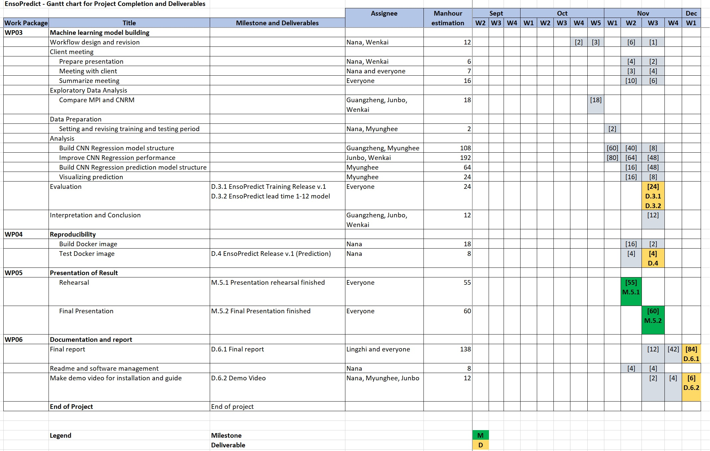

# Overview

Weather forecasting plays an important role in mitigating weather-related risks since our everyday wellbeing will always be affected by weather, whether it in short term or long term period. 

For example, weather impacts cross-boundary transportation schedule which has snowball effect on commodity prices. And then for business planning in agriculture, with seasons forecast, the government can make strategic decision for drought or flood prevention to minimize harvest failure risk or plan for better food sustainability. Likewise, weather forecast can also help government to plan for spikes in energy demand and anticipate availability of renewable energy.

So how do contemporary climate scientists forecast weather? It is by using theory based or physical models which are provided by only few agencies, one of the prominent one is NOAA-GEFS, but it is computationally expensive.

Therefore, in this EnsoPredict project, we tried to use machine learning models which can run prediction under offline environment. Hopefully with this project we can get some idea on machine learning performance as one alternative of physical based model. 

Just as the name suggest, EnsoPredict will focus on doing El-Nino prediction which is one of major weather anomaly that has widespread impact on people's socioeconomic. In short, it is a condition where a pool of warm water from western pacific ocean moves to eastern pacific, and this anomaly occurs every 2-7 years. This movement pattern is called El Nino Southern Oscillation (or ENSO) which is what we're trying to predict in this project.

EnsoPredict will try to monitor anomalies in equatorial Pacific ocean's Sea Surface Temperature by measuring its Nino3.4 index using regression Convolutional Neural Network model.

One thing to keep in mind is that EnsoPredict does not doing forecasting. It is doing hindcast or prediction on past data.

## Technology:

Application: Docker and Jupyter Notebook

Base: Python

Data: xarray

Machine Learning: pytorch

## Deliverables

Prediction Release:

Repository: <a href="https://github.com/ENSOPredict/EnsoPredictDist"> https://github.com/ENSOPredict/EnsoPredictDist </a>

Model: <a href="https://doi.org/10.6084/m9.figshare.13302755.v1">https://doi.org/10.6084/m9.figshare.13302755.v1</a>

Demo Video: <a href="https://youtu.be/RPdfDuY-QKA">https://youtu.be/RPdfDuY-QKA</a>

Final Report:

## Project Management

<a href="https://github.com/orgs/ENSOPredict/projects/1">EnsoPredict Project Kanban</a>

### The Team 2:

Project Manager: Guangzheng Wu

Member: Nana Andriana, Myunghee Lee, Junbo Sheng, Wenkai Xu, Lingzhi Zhang

### Wastes

a. Motion: In order to make hindcast predictions, climate scientists should move to places where they can access very few forecast agencies sources with online connection.

b. Waiting: Climate scientists need to wait for forecast agencies to finish preparing their requested queries after some time until they can download it.

c. Inventory: Climate scientists need to download large historical data and keep it in their computer in order to make predictions.

### Milestone

a. M.1 Project Kickoff Presentation : This is a milestone because in this phase we officially introduce our team members to the client and at same time confirm that the client can accept the formation.
At the kickoff presentation, we also make agreement regarding project scope and risks that could occur during development or release.

b. M.2 Model preference decided : This is a milestone because were it not achieved then the team would know which machine learning method they should pursue deeper. Otherwise, the researh could go wider but not any deeper. Given the timeline, there should be a cutoff time to decide which Machine Learning method should be more focussed on and be improved of its performance since the next phase of training and parameter adjustment would also take times.

c. M.5.1 Presentation rehearsal finished : This is a milestone because at this phase we can evaluate our model and deliverables compared to expected deliverables requirements. After achieving this phase and getting feedback from external people then we can better measure our need for performance improvement and focus more on what is lacking. Although it is close to the next milestone but success of rehearsal is also important to boost the team's morale in completing projects toward the final presentation.

d. M.5.2 Final Presentation finished : This is a milestone because half of the success of the project was evaluated on this phase. It will define whether the project in general was a success or not, and with a question answering session we can measure our deliverable toward clients standard.

e. End Project : This is the end of the project. No major change will be needed to the code but final report documentation will mark the completion of all project deliverables with manual guidance so that users can start to use EnsoPredict.

### Timeline:

